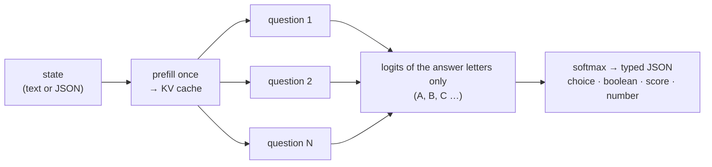

<div align="center">


# Rizzo Flow

### The open, local take on Jev: typed decisions from an LLM, without generating a single token

**_Unstructured state in → typed, probabilistic decisions out. On your own machine._**

<p>


</p>

<p>


</p>

<sub>🌐 <a href="https://rizzo-ai-academy.github.io/rizzo-flow/"><b>Website</b></a> · A project by <a href="https://www.rizzoaiacademy.com"><b>Rizzo AI Academy</b></a> · 🇮🇹 <a href="docs/README.it.md">Documentazione dettagliata in italiano</a></sub>

</div>

**Rizzo Flow** is an open-source, local-first implementation of the idea behind
[**Jev**](https://typesafe.ai/blog/introducing-system-one-models-and-jev), TypeSafe's "System One"
model: a *function call with judgment* that takes unstructured state and returns **typed decisions
with probabilities** — a yes/no, a choice among options, a score on a rubric, a number — instead
of text you then have to parse.

Jev is a closed, hosted service. Rizzo Flow gives you the same programming model **on your own
hardware, with open weights, and with the same HTTP interface**, so code written against the
TypeSafe API can point at `localhost` by changing one URL. It runs on
[llama.cpp](https://github.com/ggml-org/llama.cpp), so the hardware can be an Apple, NVIDIA, AMD
or Intel GPU, or no GPU at all.

> **Independent project.** Rizzo Flow is not affiliated with TypeSafe and does not reproduce Jev's
> proprietary architecture or its RLCD training. It reproduces the *interface pattern* with an
> off-the-shelf open model, in the spirit of [SemIf](https://github.com/TheoLeeCJ/SemIf), which
> inspired it. Probabilities are **uncalibrated** unless you calibrate them on your own data, and
> we make no claim of matching Jev or SemIf in quality. Every number below comes with its caveats.

<div align="center">
<br />
<a href="assets/snake_run.gif"></a>

<sub>🐍 <b>Fast enough to play Snake</b> — every move is one <code>POST /v1/decisions</code>. Recorded at <b>real speed</b>, not sped up:
140 moves in 25.6 s (≈ 5.5 per second), about <b>150 ms per decision</b> round trip, <b>0 generated tokens</b>.<br />
Spark-X2.5-4B at 8 bit on an RTX 5060 Ti, recorded with the earlier MLX runtime (today's llama.cpp runtime is ~1.8× faster per decision) · one game, not a benchmark · <a href="#snake-demo">about the demo ↓</a> · <a href="#quickstart">run it yourself ↓</a></sub>
</div>

---

## Quickstart

You need Python ≥ 3.11, git and [uv](https://docs.astral.sh/uv/). The same four commands work on
macOS, Windows and Linux; nothing is compiled and no GPU toolkit is installed.

```bash
git clone https://github.com/Rizzo-AI-Academy/rizzo-flow && cd rizzo-flow
uv sync --locked          # seconds: four small Python packages
uv run rizzo download     # llama.cpp for this machine + Spark-X2.5-4B Q8_0 (~4.4 GB)
uv run rizzo serve        # → http://127.0.0.1:8017/playground
```

`rizzo download` is the only slow step, and it is all download: the model (4.4 GB) plus the
llama.cpp runtime (about 570 MB with CUDA, 30 MB with Vulkan, 11 MB on a Mac). An interrupted
download resumes where it stopped. In a hurry? `uv run rizzo download --size 1.7b` fetches a
1.8 GB model that is fine for a first look and [much less accurate](#results-so-far) afterwards.

Then open <http://127.0.0.1:8017/playground>, pick an example from the **Examples…** menu (or
write your own state and questions) and press **Run** — or call the API:

```bash
curl http://127.0.0.1:8017/v1/systemone \
  -H 'Content-Type: application/json' \
  -d '{"state": "Help! My payouts have been failing for 3 days.", "model": "rizzo-latest",
       "questions": {"is_urgent": {"type": "noul", "instructions": "Does this convey urgency?"}}}'
```

<details>
<summary>The same call from Windows PowerShell</summary>

```powershell
$body = @{ state = "Help! My payouts have been failing for 3 days."; model = "rizzo-latest"
           questions = @{ is_urgent = @{ type = "noul"; instructions = "Does this convey urgency?" } }
         } | ConvertTo-Json -Depth 5
Invoke-RestMethod http://127.0.0.1:8017/v1/systemone -Method Post -ContentType "application/json" -Body $body |
  ConvertTo-Json -Depth 6
```
</details>

No server needed for one-off runs: `uv run rizzo decide examples/ticket.json`. If you prefer an
activated environment, `source .venv/bin/activate` (PowerShell: `.venv\Scripts\activate`) and drop
the `uv run` prefix.

<div align="center">
<br />
<a href="assets/playground.webp"></a>

<sub>🦔 <b>The built-in playground</b> — one state, several questions answered in parallel, probability bars, timings and the
equivalent cURL. Interface in Italian or English. (Screenshot taken with the earlier MLX runtime on an M4 Pro.)</sub>
</div>

### Which hardware, and what we have actually run

`rizzo download` picks an official prebuilt llama.cpp package for your machine and checks its
sha256. `rizzo devices` shows what the runtime sees and what `--device auto` will use.

| Your machine | Build picked (`--runtime auto`) | Status |
| --- | --- | --- |
| Windows or Linux, NVIDIA GPU | `cuda` — CUDA 13 libraries included; needs a recent driver, no toolkit | **tested on Windows 10 + RTX 5060 Ti**: every current number in this README. Linux not tried |
| Windows or Linux, AMD or Intel GPU | `vulkan` — uses the GPU driver you already have | **the Vulkan build was tested on the same RTX 5060 Ti** and gives the same answers as CUDA. Not tried on AMD or Intel hardware: [reports welcome](https://github.com/Rizzo-AI-Academy/rizzo-flow/issues) |
| Mac, Apple Silicon | `metal` | not tried yet |
| No GPU | `vulkan` falls back to the CPU; or `--runtime cpu` | not tried: we have no CPU number |

Other builds on request: `uv run rizzo download --only runtime --runtime rocm` (AMD, ROCm/HIP),
`--runtime sycl` (Intel oneAPI), `--runtime cpu`. Several builds can live side by side and
`--device vulkan` (or `cuda`, `metal`, …) picks one at start-up; a named family is a requirement,
never silently downgraded to the CPU. To use your own llama.cpp build, point `RIZZO_LLAMA_DIR` at
the folder that holds `libllama`: it must be commit `161755f`, because the bindings are tied to
that header.

Everything is pinned: llama.cpp release
[`b11081`](https://github.com/ggml-org/llama.cpp/releases/tag/b11081) from its official GitHub
releases, and the GGUF files published by the model's authors
([4B](https://huggingface.co/XHToken/Spark-X2.5-4B-GGUF),
[1.7B](https://huggingface.co/XHToken/Spark-X2.5-1.7B-GGUF)). The runtime goes to `runtimes/`,
the weights to `models/`, both git-ignored.

### Models and options

| `--size` | GGUF files (`--quant`) | Status |
| --- | --- | --- |
| `4b` (default) | `q8_0` 4.4 GB (default) · `q4_k_m` 2.6 GB · `bf16` 8.2 GB | every result in this README unless it says 1.7B |
| `1.7b` | `q8_0` 1.8 GB (default) · `q4_k_m` 1.1 GB · `bf16` 3.4 GB | ~2× faster, **much less accurate**. With abstention enabled it picks "cannot determine" almost every time: use it with `"allow_abstain": false` (the Jev-compatible endpoint always does) and check it on your own data |

`rizzo serve` flags: `--size`, `--quant`, `--device auto|gpu|cpu|cuda|vulkan|metal|rocm|sycl`,
`--port`, `--host`, `--batch-size` (question micro-batch, default 4), `--ctx` (token limit per
question, default 8192), `--threads` (CPU), `--model /path/to/file.gguf` (overrides `--size`),
`--calibration fit.json`. Set `RIZZO_API_KEY=...` before starting for Bearer auth on the
Jev-compatible endpoints. The model loads in about 10 seconds.

Quantization changes probabilities, and so does the hardware (CUDA, Vulkan and Metal round
differently): compare on your own workload, and note that a calibration is bound to the runtime,
backend and file it was fitted on.

<details>
<summary><b>Optional: the MLX runtime</b> (<code>--backend mlx</code>) — what this project ran on until September 2026</summary>

Every result marked "MLX" below was measured with it, and it is still there as an opt-in:

```bash
uv sync --locked --extra mlx                  # Apple Silicon · or --extra cuda (NVIDIA) · or --extra cpu
uv run --no-sync rizzo download --backend mlx # original safetensors, ~8 GB
uv run --no-sync rizzo serve --backend mlx --bits 8   # --bits 4|8 quantize in memory; omit for BF16
```

With an MLX extra installed use `uv run --no-sync`: a plain `uv run` re-syncs the environment
without the extra and removes it. Prompt, API and result format are the same; probabilities are
not (different kernels and quantization).
</details>

---

## Why "System One"

An LLM asked to classify something *writes* an answer: token by token, slowly, in a format you
hope is valid JSON. But for a decision you do not need text — you need **which option, and how
sure**. That information is already in the model after a single forward pass: it is the
probability it assigns to each possible answer.

Rizzo Flow reads exactly that and nothing else:



1. **Every question becomes a multiple choice.** Each candidate answer is mapped to one uppercase
   letter. The tokenizer is checked at request time: every letter must be exactly one token, in
   context. 26 letters → at most **26 answer slots** per question.
2. **The state is processed once.** It sits at the start of the prompt, so it is prefilled a
   single time. Every question then branches from it: the branches *share* the state's KV cache
   cells instead of copying them, and their texts run together in one unpadded micro-batch.
3. **Only the answer letters are read.** One position per question, the logits of the allowed
   letters, nothing else. Nothing is sampled.
4. **Plain Python turns logits into typed output.** Softmax, optional temperature, expected values
   for scores and numbers, abstention policy, and a schema-validated JSON response.

No decoding loop, no output parsing, no JSON repair, no type errors by construction.
"Zero generated tokens" is not zero latency: prefill and questions still cost compute — about
50 ms for one short decision and 1 second for 21 questions on a 2,000-token state, on an
RTX 5060 Ti at 8 bit.

---

## Primitives

### Native API — `POST /v1/decisions`

| Type | You provide | You get |
| --- | --- | --- |
| `boolean` | optional descriptions of *true* / *false* | `value`, probability of true |
| `choice` | `options` (id + description), up to 26 | `choice`, probability of every option |
| `score` | ordered `levels`, low → high | probability-weighted `score`, `normalized_score`, spread |
| `numeric` | increasing `anchors` (value + description) and a `unit` | probability-weighted `value`, median, spread, below/above-range probability |

Every type can **abstain**: a built-in `__insufficient__` option (on by default), plus
`__below_range__` / `__above_range__` for `numeric`. When those win, the primary value is `null`
and `status` says why: `ok`, `insufficient_evidence`, `out_of_range`, `uncertain`. Thresholds are
a per-question `policy`. Special options use answer slots too: 26 options without abstention, 25
with it, 24/23 anchors for `numeric`.

```json
{
  "state": {"measurement": 75, "unit": "percent"},
  "questions": {
    "fill": {
      "type": "numeric",
      "instructions": "Read the reported fill percentage.",
      "unit": "percent",
      "anchors": [
        {"value": 0, "description": "Empty"},
        {"value": 50, "description": "Half full"},
        {"value": 75, "description": "Three quarters full"},
        {"value": 100, "description": "Completely full"}
      ]
    }
  }
}
```

Anchors are representative values, **not statistical intervals**; the mean stays inside the
extreme anchors; reported quantiles are those of the discrete distribution over anchors. Details:
[docs/README.it.md](docs/README.it.md#cosa-significa-un-numero).

### Jev-compatible API — `POST /v1/systemone`, `GET /v1/models`

Same request and response shape as the public [TypeSafe API reference](https://docs.typesafe.ai/api):

| Type | `criteria` | Answer |
| --- | --- | --- |
| `noul` | optional `{true, false}` descriptions | `noul`: probability of yes, 0–1 |
| `choice` | map *option → description* (or `null`), up to 26 | `choice`, `probabilities`, `confidence` |
| `score` | ordered array of level descriptions, up to 10 | `score`, `legend`, `probabilities`, `confidence` |

```bash
curl http://127.0.0.1:8017/v1/systemone \
  -H 'Content-Type: application/json' \
  -d '{
    "state": "Help! My payouts have been failing for 3 days.",
    "model": "rizzo-latest",
    "questions": {
      "is_urgent": {"type": "noul", "instructions": "Does this convey urgency?"},
      "department": {"type": "choice", "instructions": "Which team should handle this?",
        "criteria": {"billing": "Payments, invoicing, refunds", "technical": "Bugs, outages", "sales": null}},
      "frustration": {"type": "score", "instructions": "How frustrated is the customer?",
        "criteria": ["Calm", "Frustrated", "Very angry"]}
    }
  }'
```

A real response (Q8_0, values rounded, `x_rizzo` omitted) — 83 ms in total for the three answers:

```json
{
  "model": "rizzo-spark-x2.5-4b-q8_0",
  "answers": {
    "is_urgent":   {"type": "noul", "noul": 0.99998},
    "department":  {"type": "choice", "choice": "billing",
                    "probabilities": {"billing": 1.0, "technical": 0.0, "sales": 0.0}, "confidence": 1.0},
    "frustration": {"type": "score", "score": 1.0, "legend": {"0": "Calm", "1": "Frustrated", "2": "Very angry"},
                    "probabilities": {"0": 0.0, "1": 0.99999, "2": 0.0}, "confidence": 0.99999}
  },
  "usage": {"input_tokens": 291, "output_tokens": 0}
}
```

A client written for the hosted API can target Rizzo Flow by changing only the base URL (for the
official SDKs: `TYPESAFE_BASE_URL=http://127.0.0.1:8017` — designed for it, not yet tested with
the real SDK). **The interface is compatible, the model is not Jev:**

- `model` accepts `rizzo-latest`, the local id, and any `jev-*` name as a convenience alias. The
  response **always reports the local model id** — no answer ever presents itself as Jev.
- `instructions` and `criteria` may be strings, objects or arrays, as in the original.
- No abstention in this format (`allow_abstain: false`); `noul` is P(yes) over two options.
- `confidence = (n · p_max − 1) / (n − 1)`, the statistic shown on TypeSafe's Confidence page;
  Jev's exact formula is not public. It describes the *shape* of the distribution, not the
  probability of being right.
- `usage.input_tokens` counts the state once plus the question suffixes; `output_tokens` is always 0.
- `x_rizzo` (timings, fingerprint) is an extension outside the contract.
- Bearer auth like the original, enforced only if `RIZZO_API_KEY` is set. Errors: 401, 422.

**Asking many questions at once is the point.** All questions in one request share the state's KV
cache: 8 yes/no questions on a 218-token contract cost 1 prefill + 2 micro-batches, 136 ms of
inference in total rather than 8 full passes. (It got 7 of the 8 right: asked whether a 60-day
payment term is longer than 30 days, it said no with p = 0.75. Probabilities are not guarantees.)

---

## A model with a native 1M-token context

Rizzo Flow runs [**XHToken/Spark-X2.5-4B**](https://huggingface.co/XHToken/Spark-X2.5-4B) by
default, or the smaller [**Spark-X2.5-1.7B**](https://huggingface.co/XHToken/Spark-X2.5-1.7B)
(both Apache-2.0). The model handles up to **1M tokens** (1,048,576, native). Out of the box a
question (state + question) is limited to **8,192 tokens**; raise it with `--ctx`. The KV cache
is reserved at start-up and costs ~144 KiB per token on the 4B: about 1.4 GiB at the default,
4.8 GiB at 32k. Beyond ~60k tokens also raise the 256 KB `state` cap in `schema.py`. Our committed
measurements stop at states of ~2,000 tokens. Oversized inputs are rejected, never truncated.

| Input context | Rizzo Flow | Jev (TypeSafe) | SemIf |
| --- | ---: | ---: | ---: |
| Model maximum | **1M tokens** (native) | 32k for state + longest question · 64k per request | 262k native (Qwen3.5-4B; ~1M with YaRN) |
| Default limit | 8,192 (`--ctx`) | — | 4,096 (`--max-tokens`) |

Sources: [TypeSafe models](https://docs.typesafe.ai/models),
[Qwen3.5-4B model card](https://huggingface.co/Qwen/Qwen3.5-4B), SemIf's CLI at commit `ca3ba65`.

---

## Playground and Snake

### Playground

<http://127.0.0.1:8017/playground> ([screenshot above](#quickstart)) is a single self-contained
page served by the backend, with no external calls: a question builder for noul / choice / score,
ready-made examples, a raw JSON editor for both endpoints (so you can try `numeric` and abstention
too), probability bars, timings (round-trip, inference, state prefill, micro-batches, cached
state tokens) and the equivalent cURL. The badge in the header shows which checkpoint and
precision is answering. Bilingual: switch **IT / EN** in the header.

### Snake demo

<http://127.0.0.1:8017/snake> is a Snake game where **every move is one `POST /v1/decisions`
request**: the state describes the board, a `choice` question lists the legal moves, and the model's
answer-letter probabilities are drawn live on the candidate cells, next to bars, logits, timings
and a decision log. No text is generated. **Record GIF** captures the board plus the decision
panel in the page itself (hand-written GIF89a encoder, no dependencies) and saves the file to your
downloads when you stop.

What the model sees is selectable, and it matters. With *per-move sensors* (content of the next
cell, distance to the food, reachable free cells — all computed by the game; only the choice is
the model's) it plays well: in three informal 10×10 games on an M4 Pro (MLX runtime, 8 bit) it
ate 12 and 7 foods in 80 moves without dying, and 22 foods in 208 moves before boxing itself in
with no safe move left. With the *ASCII grid only* it died within 26 and 13 moves with 0 points in
two games: a 4B model does not read a grid spatially. These are a handful of games, not a
benchmark. Options are shuffled every move to dampen position bias; an optional safety net (off by
default, every intervention logged) replaces a lethal pick with the most probable safe move.

Interactive OpenAPI docs: <http://127.0.0.1:8017/docs>. Schemas: `request.schema.json`,
`response.schema.json`. `GET /health` reports model provenance and file hashes.

---

## Results so far

The runtime changed from MLX to llama.cpp on 22 September 2026, so there are two generations of
numbers: the current ones first, then a summary of what MLX measured. Timings exclude model load
and warm-up and include request compilation plus synchronized GPU inference. All reports are
committed, create-only, with logits, prompt hashes and weight hashes:
[results/](results/README.md) (Italian).

### Current runtime: llama.cpp, prompt v3, Windows + RTX 5060 Ti 16 GB

[SemIf](https://github.com/TheoLeeCJ/SemIf)'s committed fixtures (file hashes verified), scored
with SemIf's own `benchmarks/evaluate.py` through `scripts/semif_compare.py`: same rows, same
metric, same timing scope; each system keeps its own prompt and model. GGUF files are the ones
published by the model's authors.

| Measure (Spark-X2.5-4B) | Q8_0 · CUDA (default) | BF16 · CUDA | Q4_K_M · CUDA | Q8_0 · Vulkan, same GPU | before: MLX-CUDA Q8 | SemIf Q8 (published) |
| --- | ---: | ---: | ---: | ---: | ---: | ---: |
| `authored144`, mean-family balanced accuracy | 0.812 | 0.829 | 0.769 | 0.807 | 0.829 | 0.819 |
| — held-out half only (72 rows) | 0.793 | 0.824 | 0.730 | 0.781 | 0.824 | 0.811 |
| `perturbations108` | 0.848 | 0.859 | 0.835 | 0.854 | 0.865 | 0.766 |
| — held-out half only (54 rows) | 0.861 | 0.875 | 0.801 | 0.861 | 0.875 | 0.824 |
| Argmax flips: option reversal / wrapper / irrelevant context | 5 / 4 / 5 | 4 / 3 / 3 | 6 / 3 / 2 | 4 / 3 / 5 | 4 / 2 / 3 | 9 / 7 / 4 |
| Missing evidence (36 rows): accuracy | 0.750 | 0.778 | 0.722 | 0.750 | 0.778 | 0.861 |
| — confident (p ≥ 0.8) answers where `insufficient` was right | **6** | **6** | 5 | **6** | **6** | 1 |
| Per-decision latency, short state (p50 / p95) | **49 / 52 ms** | 60 / 63 ms | 51 / 54 ms | 90 / 94 ms | 87 / 94 ms | not comparable |
| `shape777` shared: 37 states (~2k tokens) × 21 criteria | **20.99 decisions/s** · 1.00 s per state | 17.75 · 1.19 s | 19.98 · 1.05 s | 14.84 · 1.35 s | 7.52 · 1.76 s | not comparable |
| `shape777` fresh | 2.60 decisions/s | 1.97 | 2.39 (3 states) | 1.74 (3 states) | 1.65 | not comparable |
| Argmax changes, shared vs fresh | 13 of 777 (max Δp 0.163) | 1 of 777 (0.064) | 2 of 63 (0.204) | 0 of 63 (0.028) | 2 of 777 (0.144) | — |
| Peak GPU memory (drop in free memory since before the load) | 5.6 GiB | 9.3 GiB | 3.9 GiB | 6.0 GiB | 6.55 GiB (MLX allocator) | — |

Reading this honestly:

- **Changing the runtime did not change the quality beyond noise, and did not improve it.** Against
  the MLX run with the same prompt, llama.cpp Q8_0 picks a different option on 5 rows of 252:
  paired difference −0.017 on both sets, 95% interval [−0.043, 0.000]. At BF16 the two runtimes
  differ on 4 rows (+0.009 [0.000, +0.028]). Q8_0 here is llama.cpp's format, not MLX's 8-bit:
  they are different quantizations of the same weights. One row is 0.7–1.4 points.
- **Against SemIf the picture is the same as before: tied.** Q8_0 −0.007 [−0.076, +0.065] on
  `authored144`, BF16 +0.015 [−0.041, +0.079]. We claim no superiority. Half of these rows are
  the dev split prompt v3 was chosen on; the held-out half had been looked at once for the
  prompt and is reported again here only because the runtime changed.
- **It is faster on the same GPU**: 1.8× per short decision and 2.8× on shared states at 8 bit
  (20.99 against 7.52 decisions/s). Two reasons: llama.cpp's quantized CUDA kernels, and flat
  batches without padding. With llama.cpp Q8_0 is also faster than BF16, the opposite of what we
  measured with MLX-CUDA.
- **The Vulkan build gives the same answers as the CUDA build** on this card (3 different rows of
  252, −0.005 [−0.017, 0.000]) at about 1.4–1.8× the latency. This is the build AMD and Intel GPUs
  use, but it was **not run on AMD or Intel hardware**.
- **Shared-prefix scoring moves near-ties more at Q8_0**: 13 of 777 decisions change argmax
  between shared and fresh (every one of them had a margin below 0.24; median |Δp| 0.0002), against
  1 of 777 at BF16 and 2 with MLX. If a threshold matters, do not put it near 0.5.
- **Q4_K_M costs accuracy**: −0.043 [−0.079, −0.008] on `authored144` against Q8_0, for 1.7 GiB
  less memory and no gain in speed. Use it only if memory is what you lack.
- **Unchanged weaknesses**: 6 confident wrong answers out of 36 when the evidence is missing
  (SemIf: 1), and `rule_application` under perturbation (0.611, NLL 1.69 — confidently wrong).
- **The 1.7B checkpoint** (Q8_0, CUDA): `authored144` 0.678, `perturbations108` 0.640 (held-out
  0.690 / 0.514), 18 of 36 argmax flips under option reversal, `rule_application` 0.315 under
  perturbation (NLL 3.51), picks `insufficient` 52 times where 36 are expected. 25 / 27 ms per
  decision, 31.59 decisions/s shared, 5.51 fresh, 31 argmax changes of 777 between the two, 2.3 GiB.
  Paired difference from the 4B −0.134 [−0.212, −0.051]: about twice as fast, clearly worse.
- **Own fixtures** (small, read while writing the prompt: a smoke test, not a benchmark): 19/20
  labelled decisions (NLL 0.459), 9/9 perturbations, median 66 ms over 17 requests; a long state
  with 4 questions takes 0.47 s shared against 1.30 s fresh, same argmax.
- Still not run: macOS/Metal, Linux, AMD, Intel and CPU-only with this runtime; WANLI, Every, the
  TypeSafe subset; SemIf on this same GPU. Details and reports:
  [`results/README.md`](results/README.md).

### Before llama.cpp: the MLX runtime, for the record

Until 21 September 2026 Rizzo Flow ran on MLX only. These are the numbers published then, with the
same fixtures and metric; MLX is still available as `--backend mlx`.

| Measure (Spark-X2.5-4B, MLX) | M4 Pro · Q8 · prompt v2 | RTX 5060 Ti · Q8 · prompt v3 | RTX 5060 Ti · BF16 · prompt v3 |
| --- | ---: | ---: | ---: |
| `authored144` / `perturbations108` | 0.758 / 0.706 | 0.829 / 0.865 | 0.819 / 0.842 |
| — held-out halves | — | 0.824 / 0.875 | 0.806 / 0.843 |
| Per-decision latency, short state (p50 / p95) | 254 / 259 ms | 87 / 94 ms | 76 / 78 ms |
| `shape777` shared | 3.92 decisions/s · 5.33 s per state | 7.52 · 1.76 s | 15.99 · 1.31 s |
| `shape777` fresh | 0.31 decisions/s (3 states) | 1.65 | 1.97 |
| Argmax changes, shared vs fresh | 0 of 63 | 2 of 777 | 2 of 777 |
| Peak MLX allocation | 4.88 GiB (smoke) | 6.55 GiB | 10.13 GiB |

- The jump from 0.758 to 0.829 is **the prompt** (v2 → v3, next section), not the hardware.
- Prompt v3 has never been measured on the Mac, and llama.cpp has never been run there: the M4 Pro
  column is the only Apple number we have, and it is two steps old.
- With MLX-CUDA, BF16 was 2.1× faster than Q8 on shared states; with llama.cpp it is the other
  way round.
- The 1.7B on MLX-CUDA (Q8): 0.700 / 0.633, 40 / 44 ms, 20.57 decisions/s shared.
- Own smoke fixtures on the M4 Pro with prompt v2: 18/20 at 8 bit, median 304 ms.

Every report, including these: [`results/README.md`](results/README.md).

### How prompt v3 was chosen (dev split only)

The fixtures were split by source group into dev and held-out halves, and prompt variants were
compared **on dev only** (`scripts/prompt_lab.py`, MLX on the M4 Pro, logs in
`results/prompt-lab/*.txt`):

| Variant (dev: 72 base + 54 perturbed rows, 8 bit) | base | perturbed | flips on option reversal | own smoke |
| --- | ---: | ---: | ---: | ---: |
| v2 (JSON state, JSON question) | 0.754 | 0.711 | 6 | 0.90 |
| **v3**: short system prompt + plain-text multiple choice, state as text | 0.827 | 0.852 | 2 | 0.95 |
| short system prompt + plain-text multiple choice, state as JSON | 0.806 | 0.852 | 1 | 0.95 |
| …plus longer guidance (rules, abstention, "order is arbitrary") | 0.79–0.81 | 0.80–0.82 | 2–3 | 0.90–0.95 |

A plain-text multiple-choice question and a short, decision-focused system prompt both help and
reduce position bias; longer instructions do not. The dev numbers chose a candidate, they do not
prove it: the held-out half was then run once and agreed (0.824 / 0.875 with MLX-CUDA). The prompt
did not change with the runtime: llama.cpp receives byte-identical prompts and token ids (same
`prompt_sha256`, same `input_tokens`). Exact prompts, every variant and the per-family numbers:
[docs/prompt-lab.md](docs/prompt-lab.md) (Italian).

---

## Calibration

Out of the box the distributions are often extremely peaked (0.9999 where Jev's docs show 0.88),
so thresholds designed for Jev's `confidence` do not transfer. Temperature scaling is built in,
per primitive, and bound to a fingerprint of weights, precision, runtime, compute backend and
prompt version (so a fit made on MLX, or on CUDA, does not load on Vulkan):

```bash
rizzo calibrate calibration.jsonl --fingerprint MODEL_HASH --output calibration-fit.json
rizzo serve --calibration calibration-fit.json
```

You need labelled data from your own domain, a separate calibration set, and a held-out test. The
evaluator reports accuracy, NLL, Brier, ECE and coverage.

## Known limitations

- Probabilities are uncalibrated by default; `status: ok` does not mean *correct*.
- The model under-uses abstention and out-of-range options, and answers confidently when the
  evidence is missing (6 of 36 cases, against SemIf's 1).
- Residual position bias; permutation debiasing is not implemented.
- 26 options per question (Jev: 255; SemIf: 16). Beyond that you need two stages.
- **Tested on one machine.** Only Windows + NVIDIA (CUDA and Vulkan builds) has been run by us;
  macOS/Metal, Linux, AMD, Intel and CPU-only are untested.
- llama.cpp is driven through ctypes bindings tied to one pinned release (`b11081`): a build of
  another commit can crash instead of failing cleanly.
- The KV cache costs ~144 KiB per token on the 4B, four times what the MLX runtime needs:
  llama.cpp's compact sliding-window cache cannot be shared between prefix branches, so every
  position is kept for those layers too.
- At Q8_0, scoring with the shared prefix flips a near-tie now and then (13 of 777 decisions
  against scoring each question alone). Do not put a threshold near 0.5.
- One resident model; concurrent requests are serialized.
- English is strongest; an Italian boolean flipped between BF16 and 8 bit in our smoke set (MLX).
- Localhost by default; no rate limiting; not hardened for public exposure.

## Jevbet (card / betting layer)

This fork adds **[Jevbet](docs/jevbet.md)** — a sibling package (`src/jevbet/`) that maps card and
betting table state to Rizzo `/v1/decisions` requests (blackjack, Texas Hold'em, poker italiano,
tre sette, scopa, roulette), with bankroll policy helpers and a Playwright/mock browser scaffold.
It does not fine-tune Spark weights and does not fork the inference path.

```bash
uv run jevbet decide examples/games/blackjack.json --schema-only
uv run jevbet demo --game blackjack
```

## Development

```bash
uv sync --locked --extra test
uv run pytest -q                        # unit tests, no weights needed
RIZZO_REAL=1 uv run pytest -q -m integration   # more, on the real runtime and GGUF weights
uv run ruff check src tests scripts
uv run rizzo evaluate benchmarks/smoke.jsonl --compare-modes --output results/local-smoke.json
uv run python scripts/semif_compare.py --system rizzo --semif ../SemIf --output results/local-semif
uv run python scripts/semif_report.py results/local-semif --semif ../SemIf   # held-out halves, paired differences
```

Architecture notes and the current state of the work: [CLAUDE.md](CLAUDE.md) (Italian).
Jevbet notes: [docs/jevbet.md](docs/jevbet.md).

## Credits

- [TypeSafe — *Introducing System One models and Jev*](https://typesafe.ai/blog/introducing-system-one-models-and-jev)
  and the [TypeSafe docs](https://docs.typesafe.ai/introduction): the idea, the primitives and the
  API shape this project mirrors. "Jev" and "TypeSafe" belong to their owners.
- [SemIf](https://github.com/TheoLeeCJ/SemIf) by TheoLeeCJ (MIT): the open option-logit baseline
  that inspired this work, and the fixtures and evaluator used for the comparison. No SemIf source
  files are copied here.
- [Spark-X2.5-4B](https://huggingface.co/XHToken/Spark-X2.5-4B) (revision `0bcb3567…`),
  [Spark-X2.5-1.7B](https://huggingface.co/XHToken/Spark-X2.5-1.7B) (revision `14d6e83c…`) and their
  official GGUF conversions ([4B](https://huggingface.co/XHToken/Spark-X2.5-4B-GGUF) `9826e0be…`,
  [1.7B](https://huggingface.co/XHToken/Spark-X2.5-1.7B-GGUF) `1f7fa33b…`), all Apache-2.0.
- [llama.cpp](https://github.com/ggml-org/llama.cpp) (MIT), release `b11081`: the runtime,
  downloaded as official prebuilt binaries. Optional second runtime: the official
  [Spark MLX runtime](https://github.com/XHToken/Spark-MLX-LLM) (commit `de2b4379…`, Apache-2.0)
  with MLX `0.32.2` and MLX-LM `0.31.3`.

## Contributors

- [**Simone Rizzo**](https://github.com/simone-rizzo) — author and maintainer.
- [**BiG86**](https://github.com/BiG86) — the reason Rizzo Flow runs on llama.cpp. Their
  [pull request #1](https://github.com/Rizzo-AI-Academy/rizzo-flow/pull/1) was the first to run
  the project outside MLX, on an AMD GPU through llama.cpp, with a pinned and verified toolchain
  and honest measurements. It convinced us to make llama.cpp the default runtime for every
  GPU vendor. The implementation on `main` is a separate one (prebuilt binaries instead of a
  build step); their fix to `.gitignore` for local result files is merged as their commit.

Want to be next? The most useful contribution right now is a run on hardware we do not have:
an AMD or Intel GPU, a Mac, Linux, or a machine without a GPU —
[open an issue](https://github.com/Rizzo-AI-Academy/rizzo-flow/issues) with the output of
`rizzo devices` and your timings.

## License

Released under the **[Apache License 2.0](LICENSE)** © 2026 Simone Rizzo — Rizzo AI Academy — the
same license as the Spark-X2.5 models it runs. Third-party attributions are in [NOTICE](NOTICE);
model weights and the runtimes are downloaded from their sources and keep their own licenses.

---

<div align="center">

**Author** — Simone Rizzo · **A project by** [Rizzo AI Academy](https://www.rizzoaiacademy.com)

→ [www.rizzoaiacademy.com](https://www.rizzoaiacademy.com)

</div>
